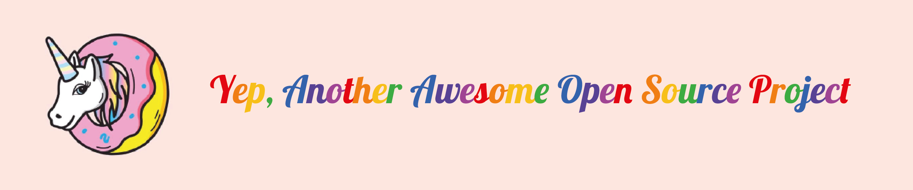

# Project Name

**Short Description (140 chracters)**

## About this project
Lorem ipsum dolor sit amet, consectetur adipiscing elit. Vestibulum quis est eu nisl porttitor molestie ut nec felis. Proin est elit, porttitor ut tempor eleifend, consectetur sed justo. Donec lacinia urna turpis, sed dictum libero elementum sed. Aliquam gravida ex eget mollis porta. Nam facilisis sit amet nunc in porta. Curabitur lobortis sapien lectus, sed auctor orci ornare sed. Donec at ligula aliquam, commodo arcu sit amet, porta enim. Vestibulum tristique diam ac lectus pretium commodo. Fusce eleifend eget quam vel rutrum. Cras sollicitudin scelerisque enim eget fermentum. Etiam commodo sem nunc, sit amet pellentesque enim lacinia eget. Curabitur congue turpis vel orci iaculis vulputate.

Pellentesque ultricies laoreet sodales. Sed eget fringilla diam, a ullamcorper nunc. Phasellus luctus tellus sit amet sem dignissim, eu rhoncus lacus commodo. Mauris tincidunt aliquam est, vitae laoreet velit pulvinar eu. Curabitur eu luctus tortor. Suspendisse mollis fringilla diam sit amet volutpat. Suspendisse luctus interdum pulvinar.

## People involved

### Core Team

**Leaders**

- [@Lorem (Name Surname) (Dev Ops)]()
- [@Lorem (Name Surname) (Backend)]()
- [@Lorem (Name Surname) (Frontend)]()

**Manteiners**

- [@Lorem (Name Surname) (Backend)]()
- [@Lorem (Name Surname) (Frontend)]()
- [@Lorem (Name Surname) (Art/UX)]()

### Contributors

- [@Lorem (Name Surname)]()

## Who supports this project?

**Company Name**

_[About the company Text] Lorem ipsum dolor sit amet, consectetur adipiscing elit. Vestibulum quis est eu nisl porttitor molestie ut nec felis. Proin est elit, porttitor ut tempor eleifend, consectetur sed justo._

## Technologies used

Lorem ipsum dolor sit amet, consectetur adipiscing elit. Vestibulum quis est eu nisl porttitor molestie ut nec felis. Proin est elit, porttitor ut tempor eleifend, consectetur sed justo. Donec lacinia urna turpis, sed dictum libero elementum sed. Aliquam gravida ex eget mollis porta. Nam facilisis sit amet nunc in porta. Curabitur lobortis sapien lectus, sed auctor orci ornare sed. Donec at ligula aliquam, commodo arcu sit amet, porta enim. Vestibulum tristique diam ac lectus pretium commodo. Fusce eleifend eget quam vel rutrum. Cras sollicitudin scelerisque enim eget fermentum. Etiam commodo sem nunc, sit amet pellentesque enim lacinia eget. Curabitur congue turpis vel orci iaculis vulputate.

## We are looking for...

**Role Name**

_[Role description] Lorem ipsum dolor sit amet, consectetur adipiscing elit. Vestibulum quis est eu nisl porttitor molestie ut nec felis. Proin est elit, porttitor ut tempor eleifend, consectetur sed justo. Donec lacinia urna turpis, sed dictum libero elementum sed. Aliquam gravida ex eget mollis porta. Nam facilisis sit amet nunc in porta. Curabitur lobortis sapien lectus, sed auctor orci ornare sed. Donec at ligula aliquam, commodo arcu sit amet, porta enim._

## How to install/run it?

Please check [Installation](INSTALLATION.md)

## How to contribute?

Please check [contributing](CONTRIBUTING.md)

## Code of conduct

Please check [code of conduct](CODE_OF_CONDUCT.md)

## Additional info

Pellentesque ultricies laoreet sodales. Sed eget fringilla diam, a ullamcorper nunc. Phasellus luctus tellus sit amet sem dignissim, eu rhoncus lacus commodo. Mauris tincidunt aliquam est, vitae laoreet velit pulvinar eu. Curabitur eu luctus tortor. Suspendisse mollis fringilla diam sit amet volutpat. Suspendisse luctus interdum pulvinar.

If you want to get in touch with the team, please contact us in the channel #name-of-the-channel in [Slack (invitation)](https://invitations-osweekends.herokuapp.com/)

## License

Lorem ipsum dolor sit amet, consectetur adipiscing elit.

*This project was generated using OSWeekends Starter Biolerplate v0.0.1*
